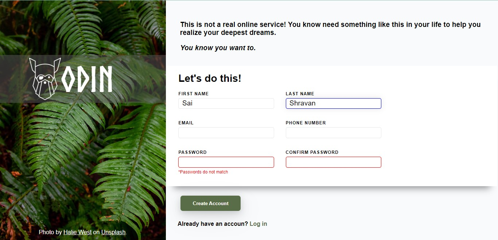

# Sign-up Form Project

This project implements a sign-up form for an imaginary service, incorporating concepts learned through [The Odin Project](https://www.theodinproject.com/).

 **[View Demo](https://shravzzv.github.io/ODIN-sign-up-form-project/)**

## Table of Contents

- [Sign-up Form Project](#sign-up-form-project)
  - [Table of Contents](#table-of-contents)
  - [Introduction](#introduction)
  - [Lessons Utilized](#lessons-utilized)
  - [Features](#features)
  - [Installation](#installation)
  - [Contributing](#contributing)
  - [License](#license)

## Introduction

This project serves as a practical implementation of concepts related to web forms. It's designed to create a sign-up form for a fictitious service, applying knowledge gained from lessons on forms provided by [The Odin Project](https://www.theodinproject.com/).

## Lessons Utilized

To complete this project successfully, I applied the following lessons from [The Odin Project](https://www.theodinproject.com/):

- [Form Basics](https://www.theodinproject.com/lessons/node-path-intermediate-html-and-css-form-basics)
- [Form Validation](https://www.theodinproject.com/lessons/node-path-intermediate-html-and-css-form-validation)

## Features

- **Form Validation**: Implements form validation to ensure data integrity.
- **Integration with Lessons**: Demonstrates practical use of concepts learned from The Odin Project.

## Installation

To set up this project locally, follow these steps:

1. Clone the repository: `git clone https://github.com/shravzzv/ODIN-sign-up-form-project`
2. Navigate to the project folder: `cd ODIN-sign-up-form-project`
3. Open `index.html` in your preferred web browser.

## Contributing

If you'd like to contribute to this project, please follow these guidelines:

1. Fork the repository.
2. Create a new branch for your feature: `git checkout -b feature-name`
3. Commit your changes: `git commit -m 'Add some feature'`
4. Push to your branch: `git push origin feature-name`
5. Submit a pull request to the main repository.

## License

This project is licensed under the [MIT License](LICENSE).

---
